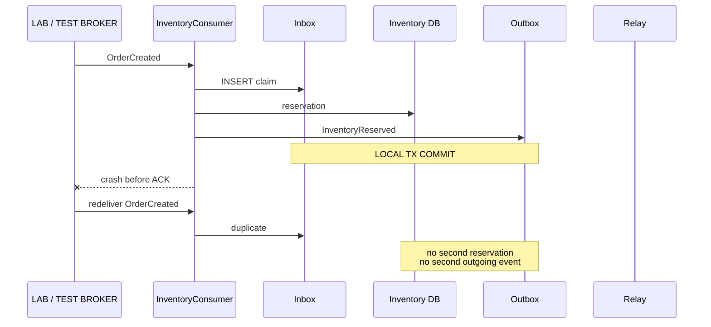
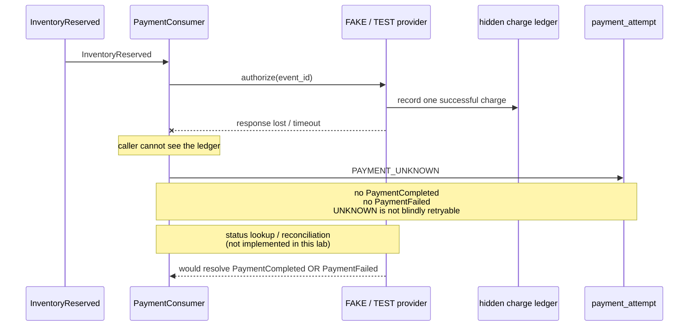

# Diagrams

## Duplicate / redelivery (critical path)

```mermaid
sequenceDiagram
    participant Broker as LAB / TEST BROKER
    participant Inv as InventoryConsumer
    participant Inbox
    participant InvDB as Inventory DB
    participant Outbox
    participant Relay

    Broker->>Inv: OrderCreated
    Inv->>Inbox: INSERT claim
    Inv->>InvDB: reservation
    Inv->>Outbox: InventoryReserved
    Note over Inbox,Outbox: LOCAL TX COMMIT
    Inv--xBroker: crash before ACK
    Broker->>Inv: redeliver OrderCreated
    Inv->>Inbox: duplicate
    Note over InvDB,Outbox: no second reservation<br/>no second outgoing event
```

## Payment timeout (CHARGE_SUCCEEDS_RESPONSE_LOST)

```mermaid
sequenceDiagram
    participant Inv as InventoryReserved
    participant Pay as PaymentConsumer
    participant Prov as FAKE / TEST provider
    participant Ledger as hidden charge ledger
    participant Attempt as payment_attempt

    Inv->>Pay: InventoryReserved
    Pay->>Prov: authorize(event_id)
    Prov->>Ledger: record one successful charge
    Prov--xPay: response lost / timeout
    Note over Pay: caller cannot see the ledger
    Pay->>Attempt: PAYMENT_UNKNOWN
    Note over Pay,Attempt: no PaymentCompleted<br/>no PaymentFailed<br/>UNKNOWN is not blindly retryable
    Note over Pay,Prov: status lookup / reconciliation<br/>(not implemented in this lab)
    Prov-->>Pay: would resolve PaymentCompleted OR PaymentFailed
```
